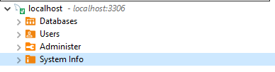
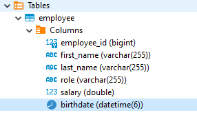
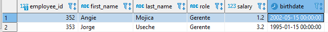
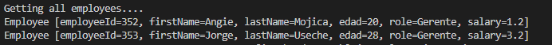

# Laboratorio 7 Y parcial: 
Angie Natalia Mojica
### Parte I. Descargar Imagen y verificar ejecución
1. Se ha descargado la imagen y corrio el contenedor.\


2. Usando un cliente en DBeaver se hizo la conexión a la base de datos \


### Parte II. Agregar nueva propiedad a empleado
Se agrego el calculo de la edad.
```java
    public int getAge(LocalDate birthdate) {
        LocalDate datecurrent = LocalDate.now();
        Period period = Period.between(birthdate, datecurrent);
        return period.getYears();
    }
 ```


### Parte III. Modificado el metodo **run**
1. Se ha modificado el método que elimina los empleados haciendo que ya no sea por ID sino que elimine todos?
    ```java
    public void deleteEmployees() {
            //employeeRepository.deleteById(employeeId);
            employeeRepository.deleteAll();
        }	
    ```
2. Se crean dos empleados, uno con mis datos y otros correspondientes al docente:\


### Parte IV. Modificando logs
1. Se muestra la edad en los logs\

